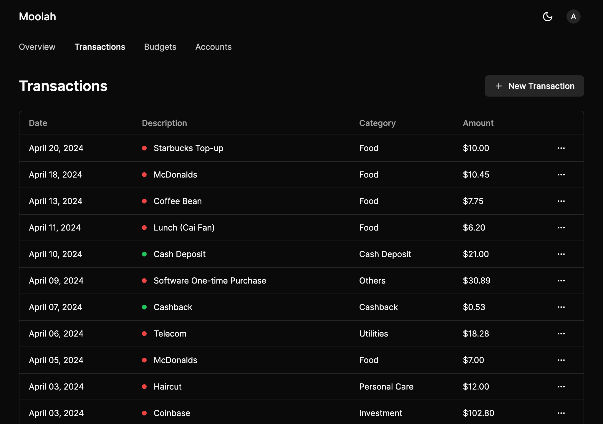

	<h1><b>Moolah</b></h1>
	
Easier way to manage your finances.

	

## Introduction

Moolah, your solution for seamless finance management. Say goodbye to spreadsheet struggles and hello to effortless tracking across multiple bank accounts. With Moolah, gain a comprehensive overview of your finances in one streamlined platform.

This project uses the following technologies:

- [**Next.js 14 App Router**](https://nextjs.org/) - The React Framework for the Web.
- [**Next Authentication v4**](https://next-auth.js.org/) - Authentication for the Web.
- [**Prisma**](https://prisma.io) - A next-generation Node.js and TypeScript ORM.
- [**TailwindCSS**](https://tailwindcss.com) + [**shadcn/ui**](https://ui.shadcn.com) & [**Radix Primitives**](https://www.radix-ui.com) - Design System.
- [**Lucide Icons**](https://lucide.dev) + [**svgl**](https://svgl.app) - Beautiful SVG icons & logos for the web.
- [**Illustration**](https://www.pixeltrue.com/packs) - By Pixeltrue from Ouch!

## 🚀 Getting Started

Coming Soon... (Working in Progress)
